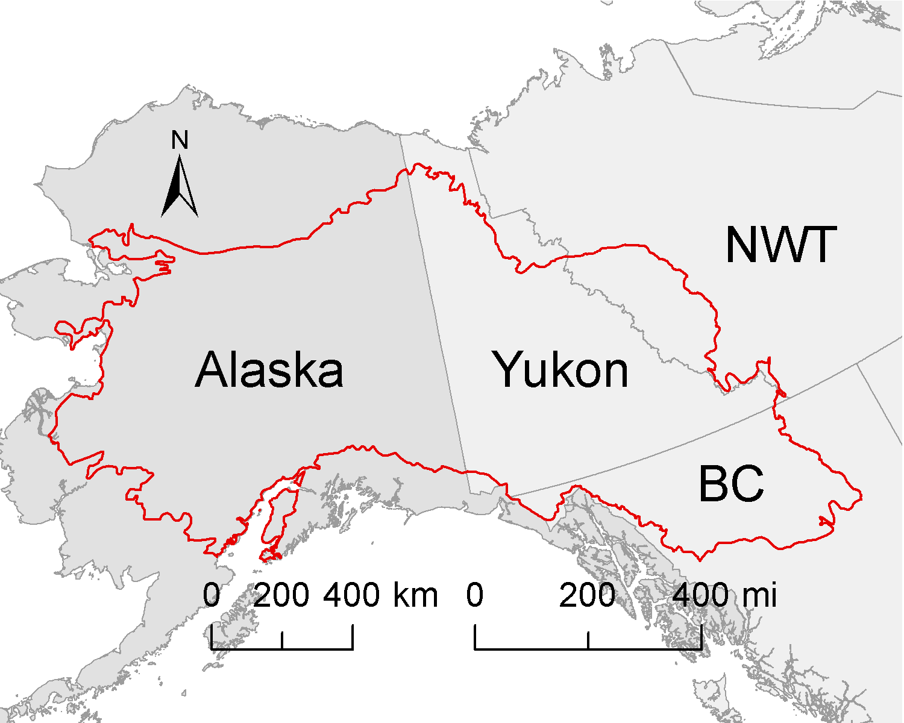

## Candidate Benchmark Networks for the Northwest Boreal Region
Updated: October 10, 2025

BEACONs partnered with the Northwest Boreal Partnership (formerly known as Northwest Boreal Landscape Conservation Cooperative or NWBLCC) to identify ecological benchmarks to advance landscape conservation across a large, dynamic region of Canada and Alaska. Support for this work was provided by the NWB Partnership, Wilburforce Foundation, University of Alberta, and Yukon Research Centre.

Ecological benchmarks provide anchors for landscape conservation by establishing the foundation for a robust and resilient protected areas network, and reference conditions for identifying sustainable land management practices. They support implementation of active adaptive management by serving as controls for human activities designed to enhance understanding of the response of biodiversity and other ecosystem values to management choices. Benchmark options have been identified for ecoregions intersecting the Northwest Boreal planning region, which includes Alaska, Yukon, Northwest Territories, and British Columbia (Figure 1).

Figure 1. NWB planning region.

### Reports

Reports and other materials from this project can be downloaded at https://beaconsproject.ualberta.ca/northwest-boreal-lcc/

### Interactive Website
Results can be explored via interactive maps and tables at https://beaconsproject.github.io/nwb

Note that we recently copied the NWB website to GitHub and, as a consequence, downloads are currently unavailable and the following ecoregion files are too large to display. This will be rectified in the near future.
- ecoregions 3, 15, 18, 21, 24, 25, 27, 29, 31, 180, 183
