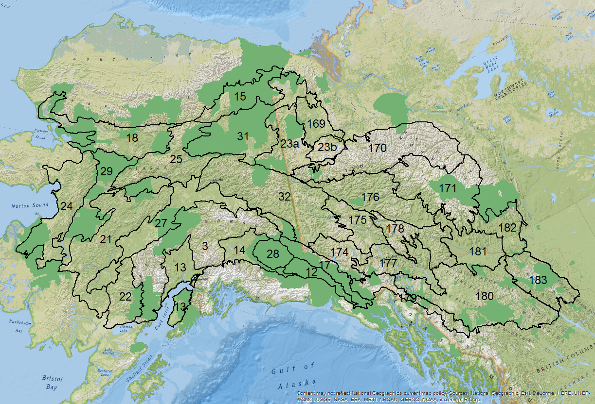
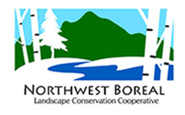

---
output:
  html_document:
    theme: cosmo
    css: _styles.css
---

<table>
<tr>
<td></td>
<td valign=top><h3>Candidate Benchmark Networks for the Northwest Boreal LCC</h3><h4>BEACONs Project, University of Alberta</h4></td>
</tr>
</table>

This website hosts interactive maps and tables for candidate benchmark networks designed for the ecoregions of the Northwest Boreal Landscape Conservation Cooperative ([NWBLCC](http://nwblcc.org/); Figure 1). Candidate benchmark networks were identified and ranked based on fundamental benchmark properties, resilience to climate change, and  representation of habitat for a suite of priority focal species. [More information...](http://www.beaconsproject.ca/nwb)

Given the spatial extent of the analysis and the volume of options available, detailed benchmark recommendations are not presented. See [main report](http://www.beaconsproject.ca/nwb) for guidelines on finer examination of potential solutions.

**Website Structure**

- **Overview** - interactive map of the NWBLCC planning region.

*The overview map includes the following data layers and information: ecoregions, hydrology units, intactness, protected areas, and MDR estimates.*

- **Ecoregion Explorer** - interactive maps and tables of ecoregion results.

*Results are organized by ecoregion and include maps that display spatial layers for benchmark networks, biophysical indicators, climate change indicators, and focal species habitat. The maps are accompanied by tables with network rankings based on the layers displayed.*

- **Downloads** - reports, tables, and shapefiles available for download.

**Viewing Recommendations**

The website is best viewed on a minimum screen size of 20" and a resolution of 1920x1080. To display maps and their legends properly on smaller screens, zoom out in the browser settings (e.g., [Chrome]( https://support.google.com/chrome/answer/96810?hl=en)).

 
 

Figure 1. The NWBLCC planning region is comprised of 30 ecoregions (black outline and identified by number) defined by the Unified Ecoregions of Alaska ([Nowacki et al. 2001](https://agdc.usgs.gov/data/usgs/erosafo/ecoreg/)) and the National Ecological Framework of Canada ([Marshall et al. 1999](http://sis.agr.gc.ca/cansis/nsdb/ecostrat/1999report/index.html)). Ecoregion 23 was further stratified using ecodistricts to account for differences in vegetation cover and the estimation of MDRs ([BEACONs 2017](downloads.html)). Protected areas are shown in green.

This project is a collaboration between the BEACONs Project (University of Alberta and Yukon College) and the Northwest Boreal Landscape Conservation Cooperative. Support for this work was provided by the NWBLCC and its partners, the Wilburforce Foundation, the University of Alberta, and the Yukon Research Centre.

<table><tr>
<td></td>
<td></td>
<td></td>
</tr></table>

